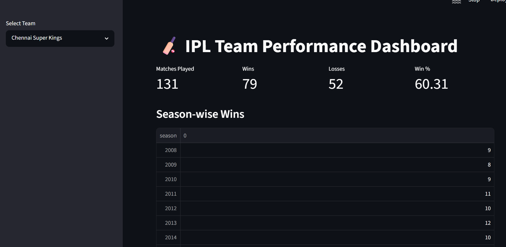
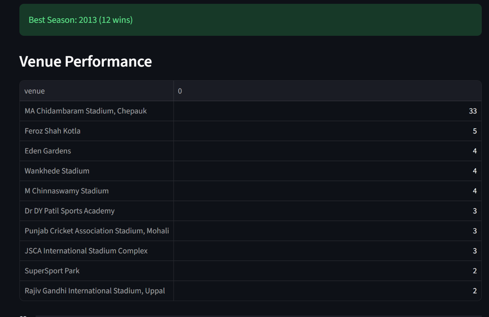
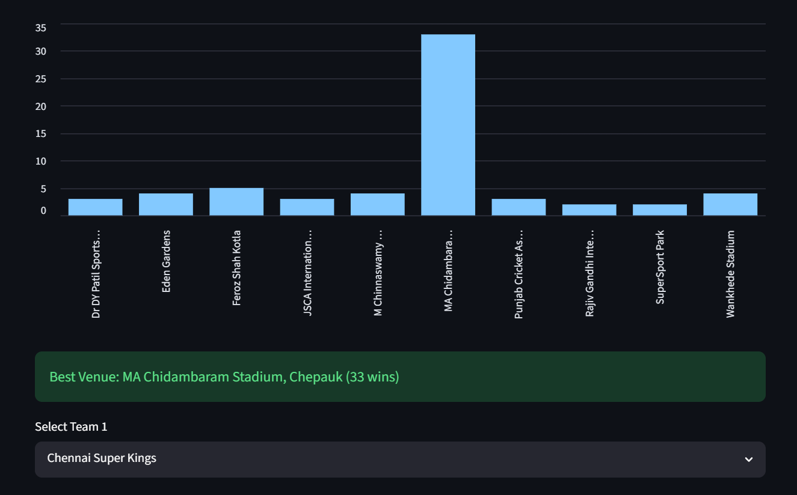
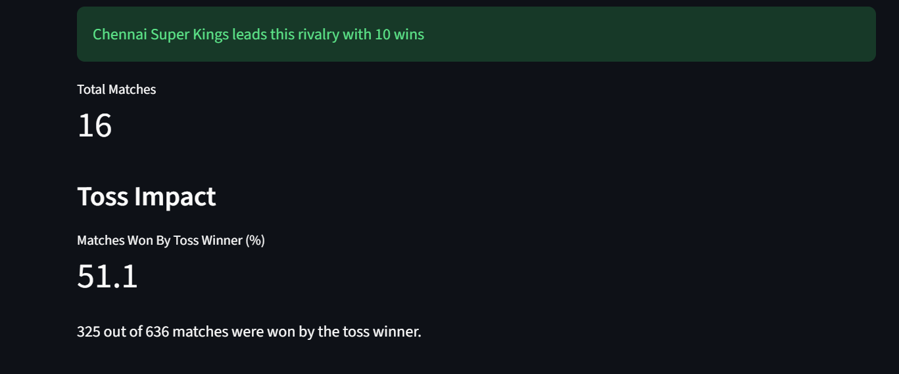

# 🏏 IPL Team Performance Dashboard

An interactive cricket analytics dashboard built using **Python, Pandas, and Streamlit** to analyze historical IPL match and ball-by-ball datasets. The application provides insights into team performance, player statistics, venue records, and match-winning factors through dynamic visualizations and analytical metrics.

---

## 🚀 Features

### Team Analytics
- Matches Played
- Total Wins & Losses
- Win Percentage
- Best Season Analysis
- Best Venue Analysis

### Match Analytics
- Head-to-Head Records
- Toss Impact Analysis
- Season-wise Performance Trends

### Batting Analytics
- Top Run Scorers
- Strike Rate Analysis
- Batting Average Analysis
- Boundary Percentage Analysis

### Bowling Analytics
- Top Wicket Takers
- Economy Rate Analysis
- Dot Ball Percentage Analysis

---

## 🛠️ Tech Stack

- Python
- Pandas
- Streamlit
- Matplotlib

---

## 📂 Project Structure

```text
IPL-Team-Performance-Dashboard
│
├── app.py
├── README.md
├── requirements.txt
│
├── data
│   ├── matches.csv
│   └── deliveries.csv
│
└── screenshots
```

---

## 📊 Dashboard Preview

### Team Performance Dashboard


### Venue Analytics


### Head-to-Head Analysis


### Best Venue Analytics


### Toss Impact Analytics


---

## 🔍 Key Insights

- Chennai Super Kings recorded their highest wins in the 2013 season.
- Mumbai Indians lead the CSK-MI rivalry based on historical IPL data.
- Approximately 51% of IPL matches were won by the toss-winning team.
- Chris Gayle recorded one of the highest boundary percentages among IPL batters.
- Glenn McGrath achieved one of the highest dot-ball percentages among bowlers.

---

## ▶️ Run Locally

Clone the repository:

```bash
git clone https://github.com/Sanjesh-v/IPL-Team-Performance-Dashboard.git
```

Navigate to the project folder:

```bash
cd IPL-Team-Performance-Dashboard
```

Install dependencies:

```bash
pip install -r requirements.txt
```

Run the Streamlit application:

```bash
python -m streamlit run app.py
```

---

## 📁 Dataset

The project uses historical IPL datasets containing:

- Match-level information
- Ball-by-ball delivery records
- Team and venue statistics
- Player batting and bowling performances

Source: Kaggle IPL Dataset

---

## 👨‍💻 Author

**Sanjesh V**

GitHub: https://github.com/Sanjesh-v