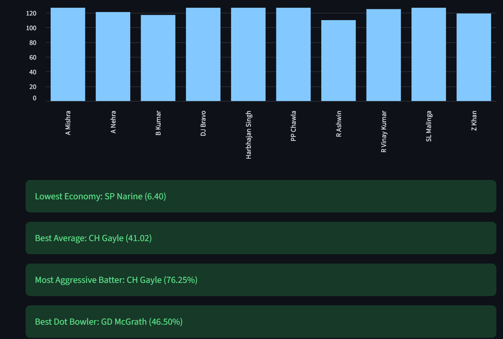
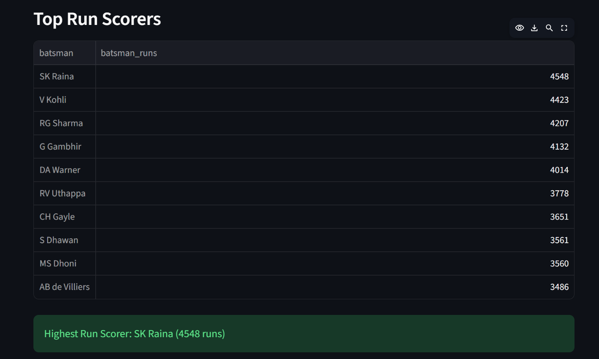
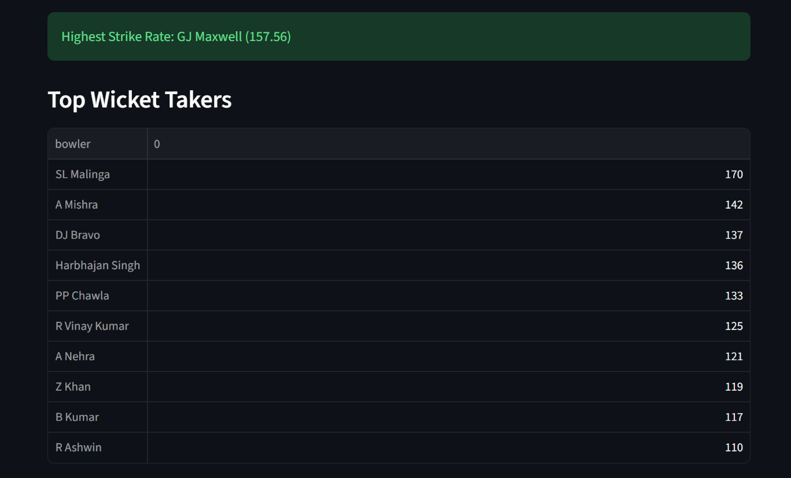

# IPL Team Performance Dashboard

An interactive cricket analytics dashboard built using Python, Pandas, and Streamlit.

## Features

- Team Performance Analysis
- Season-wise Win Trends
- Venue Performance Analysis
- Head-to-Head Comparison
- Toss Impact Analysis
- Top Run Scorers
- Strike Rate Analysis
- Batting Average Analysis
- Boundary Percentage Analysis
- Top Wicket Takers
- Economy Rate Analysis
- Dot Ball Percentage Analysis

## Technologies Used

- Python
- Pandas
- Streamlit

## Run Locally

```bash
pip install -r requirements.txt
python -m streamlit run app.py
```


## Dashboard Preview


### Main Dashboard


### Best Venue Analytics


### H2H Analytics


### Venue Analytics


### Toss Impact Analytics


### Batting and Bowling Analytics


### Top Run Scorers Analytics


### Top Wicket Takers Analytics
